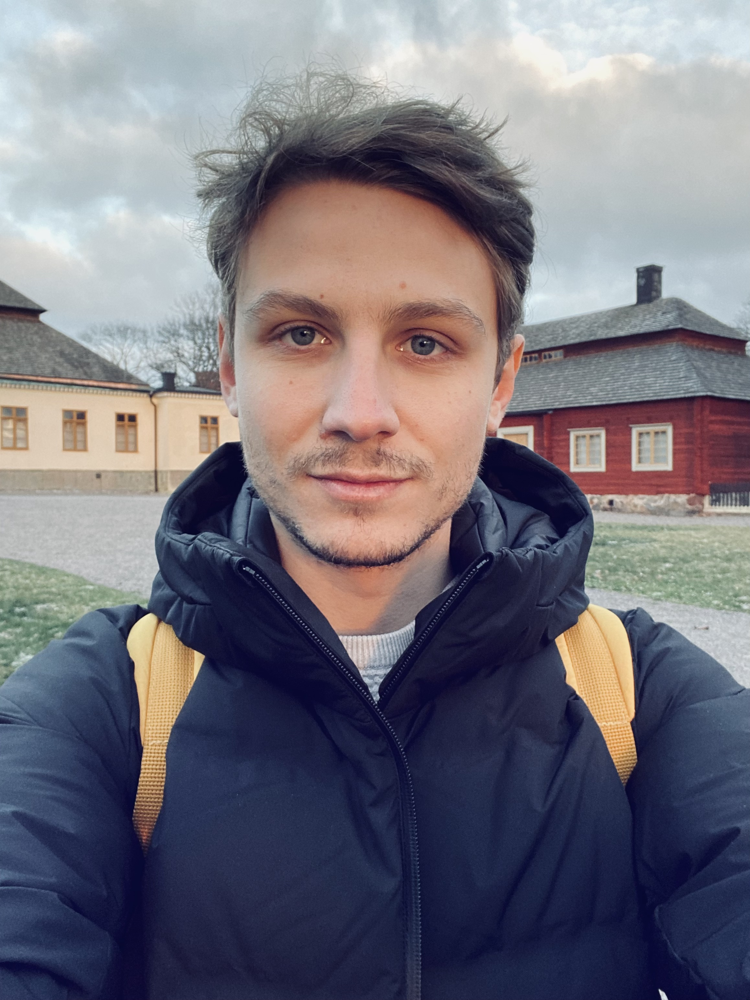

Hello and welcome to my personal academic website!

I hold a Ph.D. in Applied Mathematics and my research lies at the intersection of statistics and computer science, with applications across a broad range of physics problems. I am currently a postdoctoral researcher at CNRS, where I focus on developing machine learning models for simulating physical systems and performing uncertainty quantification.

Previously, I completed my Ph.D. at [Laboratoire de Mathématiques Blaise Pascal](https://lmbp.uca.fr/), Université Clermont Auvergne, where where I explored sampling algorithms, specifically generative models and non-reversible Markov Chain Monte Carlo techniques, with applications in cosmology. I was also a member of the [Aquila](https://www.aquila-consortium.org/) consortium.

You can download a CV [here](assets/CV.pdf).
